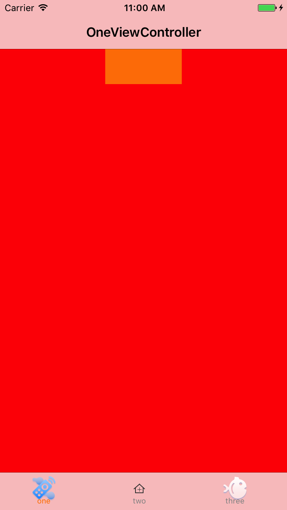
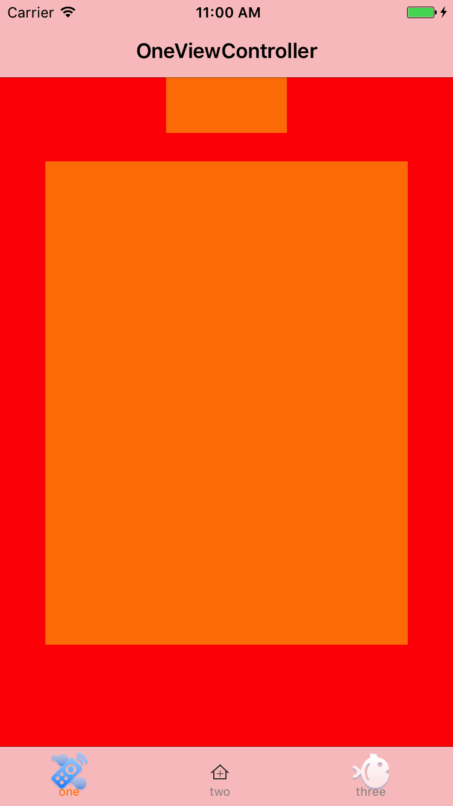
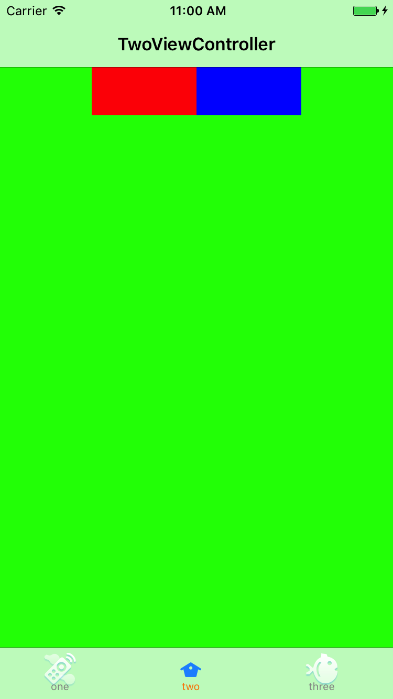
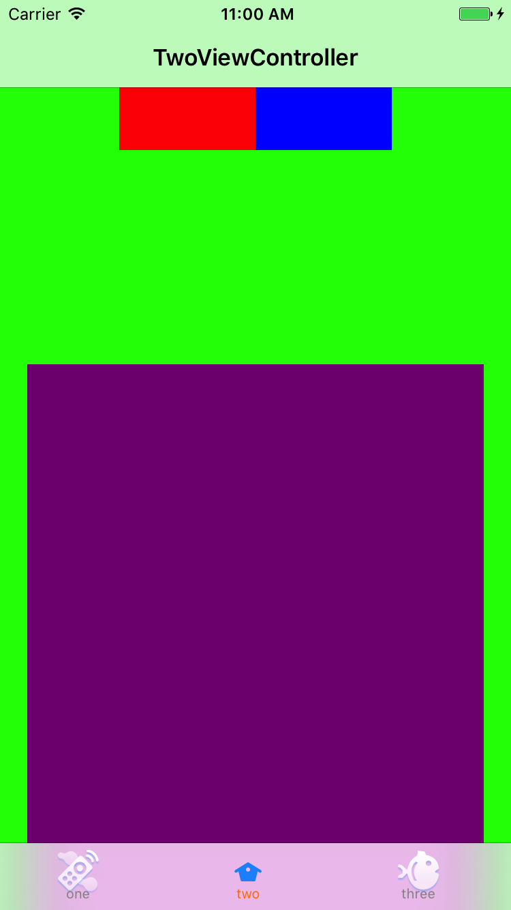
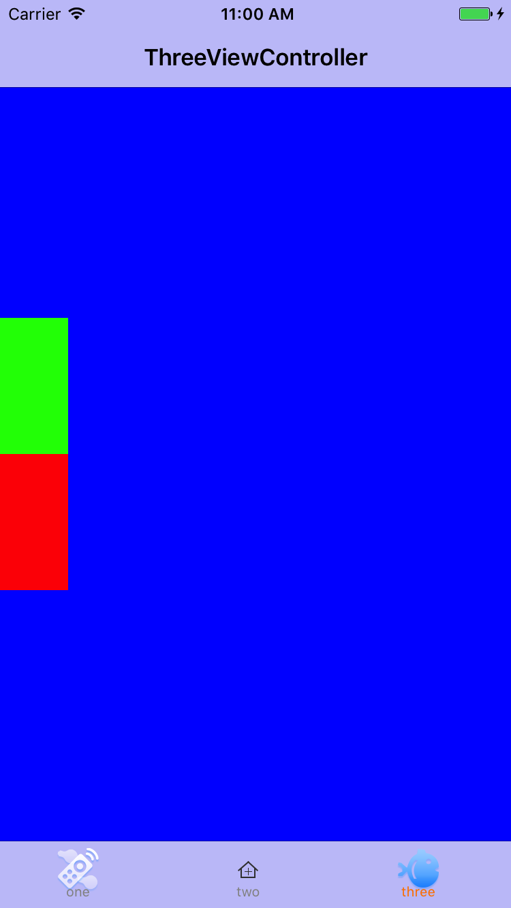
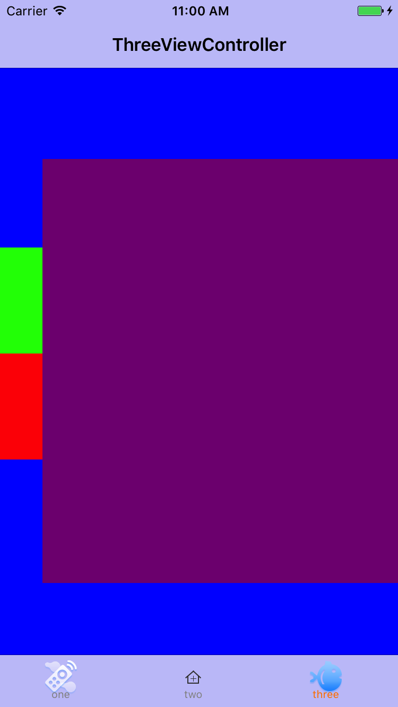

# PopView

## 创建tabbar

<pre>

for (int i = 0 ; i <titleArray.count; i ++) {

        UIViewController * view = controlArray[i];
        UINavigationController * Nv = [[UINavigationController alloc]initWithRootViewController:view];
        Nv.tabBarItem.imageInsets = UIEdgeInsetsMake(2, 0, -2, 0);
        Nv.tabBarItem.image = [[UIImage imageNamed:imageArray[i]]imageWithRenderingMode:UIImageRenderingModeAlwaysOriginal];
        Nv.tabBarItem.title = titleArray[i];
        Nv.tabBarItem.selectedImage =[[UIImage imageNamed:SelectImageArray[i]]imageWithRenderingMode:UIImageRenderingModeAlwaysOriginal];
        [Nv.tabBarItem setTitlePositionAdjustment:UIOffsetMake(-5, -5)];
        
        [controls addObject:Nv];
    }

</pre>

### 第一个视图

<pre>
self.centerView.center = self.view.center;
    [UIView animateWithDuration:.5 animations:^{
        
        CGRect p = self.centerView.frame;
        p.size.height -= 400;
        p.size.width -= 300;
        self.centerView.frame=p;
        self.centerView.center = self.view.center;
        
    } completion:^(BOOL finished) {
        NSLog(@"redShow");
    }];

</pre>

### 第二个视图

<pre>
-(void)bottomShow{
    self.bottomView.frame = CGRectMake(20, self.view.frame.size.height, self.view.frame.size.width-40, self.view.frame.size.height-100);
    [UIView animateWithDuration:.5 animations:^{
        CGRect rect = self.bottomView.frame;
        rect.origin.y -= 400;
        self.bottomView.frame = rect;
    } completion:^(BOOL finished) {
        NSLog(@"bottomShow");
    }];
}
-(void)bottomMiss{
    [UIView animateWithDuration:.5 animations:^{
        CGRect rect = self.bottomView.frame;
        rect.origin.y += 400;
        self.bottomView.frame = rect;
    } completion:^(BOOL finished) {
        NSLog(@"bottomMiss");
    }];
}

</pre>

### 第三个视图

<pre>
-(void)leftShow{
    self.bottomView.frame = CGRectMake(self.view.frame.size.width, 150, self.view.frame.size.width-40, 400);
    [UIView animateWithDuration:.5 animations:^{
        CGRect rect = self.bottomView.frame;
        rect.origin.x -= self.view.frame.size.width-40;
        self.bottomView.frame = rect;
    } completion:^(BOOL finished) {
        NSLog(@"leftShow");
        
    }];
}
-(void)leftMiss{
    [UIView animateWithDuration:.5 animations:^{
        CGRect rect = self.bottomView.frame;
        rect.origin.x += self.view.frame.size.width-40;
        self.bottomView.frame = rect;
    } completion:^(BOOL finished) {
        NSLog(@"leftMiss");
    }];
}
</pre>